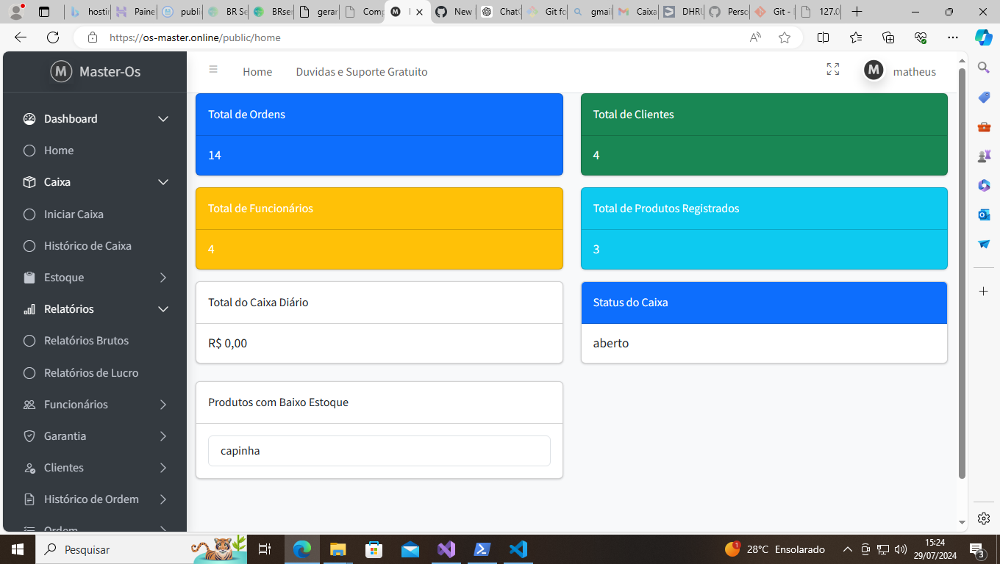

# OS-MASTER-V2



Bem-vindo ao projeto OS-MASTER-V2!

## Instruções de Configuração

Para configurar o projeto corretamente, siga os passos abaixo:

### Clone o Repositório

Primeiro, clone o repositório para sua máquina local usando o seguinte comando:

```bash
git clone https://github.com/nortan25/OS-MASTER-V2.git
cd OS-MASTER-V2
Configuração do Ambiente
Crie um arquivo .env na raiz do projeto com base no arquivo .env.example. Você pode copiar o exemplo usando:

bash
Copiar código
cp .env.example .env
Abra o arquivo .env e configure as variáveis de ambiente conforme suas necessidades.

Instalação das Dependências
Execute o comando abaixo para instalar as dependências do projeto:

bash
Copiar código
composer install
Configuração do Banco de Dados
Em vez de rodar as migrações, utilize a cópia do banco de dados disponível no arquivo db.sql.

Importe o banco de dados com o seguinte comando:

bash
Copiar código
mysql -u seu_usuario -p seu_banco_de_dados < db.sql
Configure o .env com as informações do seu banco de dados:

env
Copiar código
DB_CONNECTION=mysql
DB_HOST=127.0.0.1
DB_PORT=3306
DB_DATABASE=seu_banco_de_dados
DB_USERNAME=seu_usuario
DB_PASSWORD=sua_senha
Outras Configurações
Certifique-se de que todos os serviços necessários estejam em funcionamento e que as permissões do diretório estejam corretamente configuradas.

Suporte e Personalização
Se você tiver dúvidas, precisar de suporte ou deseja personalizar o projeto ou criar tarefas sobre encomenda, entre em contato:

WhatsApp: +55 34 99944-2627
Agradecemos por utilizar o OS-MASTER-V2!

perl
Copiar código

**Instruções para adicionar a imagem ao repositório:**

1. **Coloque a imagem no diretório apropriado**: Coloque a imagem (`OS-MASTER-V2.png`) dentro da pasta `public/images/` do seu projeto.

2. **Atualize o README.md**: Certifique-se de que o caminho da imagem no README.md corresponde ao local onde a imagem foi salva.

Depois de adicionar a imagem e atualizar o README.md, faça o commit e o push das mudanças para o seu repositório GitHub:

```bash
git add README.md public/images/OS-MASTER-V2.png
git commit -m "Adiciona print do sistema e atualiza instruções de configuração"
git push origin master